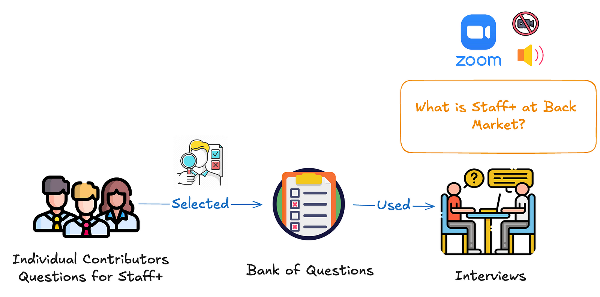
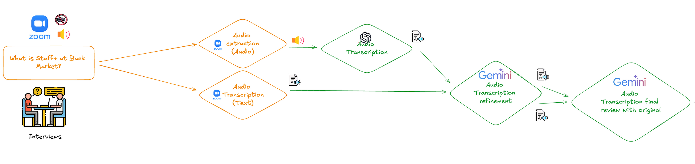
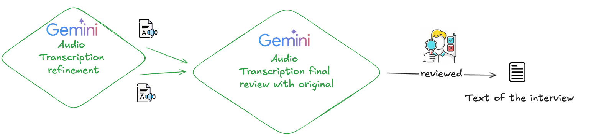
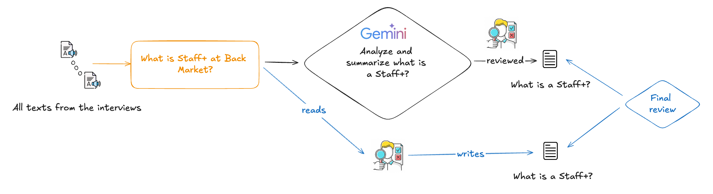

# Staff-plus GenAI Interviews

The **Staff-plus GenAI Interviews** project is designed to manage and process interview content for Back Market. This project includes functionalities to read, concatenate, and summarize interview content using a large language model in GCP.

<p align="center">
    
</p>

## 🗂️ Project Structure

- `interviews/refinement/`: Directory containing interview audio transcriptions in text files (`.txt`).
- `interviews/questions/`: Directory containing questions in text files (`.txt`).
- `interviews/audio/`: Directory containing audio files (`.mp3`).
- `prompts/`: Directory containing prompt templates for the language model (`.yaml`).
- `out/`: Directory where the output files are saved (`.md`).
- `pyproject.toml`: Project configuration file.
- `README.md`: Project documentation.

## 🛠️ Installation

1. **Clone the repository:**
    ```sh
    git clone https://github.com/backmarket-oss/staff-plus-genai-interviews.git
    cd staff-plus-genai-interviews
    ```

2. **Install dependencies:**
    ```sh
    make install
    ```

## 🚀 Usage

1. **Configure Environment Variables:**
   Set the following environment variables:
   - `GOOGLE_CLOUD_PROJECT`: Google Cloud Project Name
   - `DEFAULT_GCP_REGION`: Google Cloud Location Name (default: `europe-west2`)
   - `GENAI_MODEL`: Model name for the language model (default: `google/gemini-1.5-pro-002`)
   - `GENAI_TEMPERATURE`: Temperature setting for the language model (default: `1.0`)
   - `GENAI_MAX_TOKENS`: Maximum tokens for the language model (default: `8192`)

2. **Run the main script:**
    ```sh
    make run
    ```

## 🧪Methodology
### 1. Interview selection
[](interviews/methodology/1.Interview_selection.png)
### 2. Interview audio AI processing
[](interviews/methodology/2.Interview_audio_ai_processing.png)
### 3. Interview text review
[](interviews/methodology/3.Interview_text_review.png)
### 4. Interview text summary
[](interviews/methodology/4.Interview_text_summary.png)

# Results
[[extract_and_summarize_interviews_content_back_market.md](out/extract_and_summarize_interviews_content_back_market.md)]

## 📜 License

This project is licensed under the Apache License 2.0. See the `LICENSE` file for more details.
