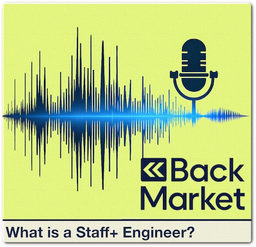

## The Staff-plus Role at Back Market: Insights from the Staff Community Generated by AI 🤖

This document summarizes interviews with several Staff-plus engineers (Staff Engineers and Principal Engineers) at Back Market to comprehensively understand the role, its challenges, and its rewards. The insights shared offer valuable guidance for anyone interested in pursuing a Staff-plus career path.

    

### Key Takeaways 🗝️

* **Impact-Driven:**  The Staff-plus role at Back Market centers around driving impact, influencing decision-making, and empowering others to achieve company-wide goals.
* **Flexibility and Agency:** Staff-plus engineers enjoy considerable autonomy in selecting and prioritizing impactful initiatives, allowing them to leverage their strengths and interests.
* **Long Feedback Loops:**  Measuring success can be challenging due to the long-term nature of initiatives, requiring patience, persistence, and a focus on indirect influence.
* **People-Oriented Approach:**  Building trust, fostering collaboration, and understanding human dynamics are crucial for navigating a leadership role without direct authority.
* **Continuous Learning:**  The ever-evolving tech landscape demands constant learning and adaptation, requiring Staff-plus engineers to embrace challenges and expand their knowledge base.

### Defining the Staff-plus Role at Back Market 🔍

**What it is:**

The Staff-plus role at Back Market is a leadership position within the Individual Contributor track. It's distinct from both Senior Engineer and Engineering Manager roles. Staff-plus engineers operate with a company-wide perspective, focusing on impactful initiatives that may take time to be visible but significantly contribute to Back Market's long-term success.
While the Staff-plus role is fluid and adapts to the company's needs, certain archetypes help define the different facets of the position:

* **Architect:**  Focusing on high-level system design, technical direction, and empowering teams to make good decisions.
* **Tech Lead:** Guiding and mentoring teams, often taking a hands-on approach to problem-solving and knowledge sharing.
* **Right Hand:** Acting as a strategic advisor and support system for senior leadership, particularly during transitions or leadership gaps.
* **Solver:** Deep diving into complex technical challenges, often taking ownership of critical issues and finding solutions.

**Influence without authority** is an essential characteristic of the role. Staff-plus engineers lack the formal power of managers, yet they are expected to drive initiatives and shape technical direction.

The day-to-day responsibilities vary greatly depending on the individual and the company's needs. However, typical tasks include:

* **Strategic planning and roadmap discussions:** Participating in conversations about company-wide initiatives, technical direction, and resource allocation.
* **Architecture reviews and technical guidance:** Providing feedback on system design, code quality, and technical decisions.
* **Mentorship and coaching:** Guiding and supporting other engineers, fostering a culture of collaboration and continuous learning.
* **Exploration and experimentation:** Investigating new technologies and approaches, acting as a catalyst for innovation within the company.
* **"Being glue":** Taking ownership of critical issues and doing whatever it takes to move things forward.

Measuring success is a nuanced challenge, as the impact of Staff-plus engineers is often long-term and difficult to quantify. Several strategies emerge:

* **Feedback loops:** Regularly seeking feedback from managers, peers, and stakeholders to gauge the effectiveness of their work.
* **Recognizing one’s influence in the success of others:** Identifying instances where their efforts have improved team performance, architecture, or company-wide initiatives. Recognizing when their work has made a tangible difference and contributed to positive change.

**What it isn't:**

* **A purely technical role:** While technical expertise is essential, Staff-plus engineers leverage their soft skills and leadership abilities to influence, empower, and guide others.
* **A management position:** Staff-plus engineers don't directly manage teams but work collaboratively with managers and individual contributors to drive initiatives.
* **A fixed archetype:**  Staff-plus engineers embody different archetypes (Tech Lead, Architect, Right-Hand, Solver) depending on the company's needs and their own interests.

### Navigating the Challenges and Embracing the Rewards 🚀

* **Measuring Impact:**
  > *"When you start operating at a Staff-plus level... your impact is perceived over a very long term." - S.*

  > *"The timescales become way longer when you become a Staff-plus engineer. We're talking about months, maybe a year, a year and a half." - G.*
* **Generating Traction:**
  > *"When you're the only one who cares about a specific topic, you really need to convince others. It's leadership without authority." - G.*

  > *"The key is to identify your stakeholders and partners and ensure that your impact is positive and that you're helping them achieve their objectives." - G.*
* **Prioritizing Tasks:**
  >*"How do I prioritize? I ask about the impact. But you also have to understand that sometimes it isn't that clear." - S.*

  > *"I rely a lot on intuition regarding how I spend my time. I also try to listen carefully to all the feedback I receive and adjust my course accordingly." - G.*

  > *"I was always a person who wanted to help, to do the best for the team, or to find a solution to a problem. I was never thinking, "I'm a backend engineer, I have to only work on this ticket today." I was always looking around for things to do beyond my daily work."  - P.*

* **Maintaining Technical Expertise:**
  > *"You need absolutely to maintain that skill regardless of whether you're actually working right now on something that requires you to be hands-on or not. You need to maintain that because there are certain things that you know now but sometimes forget." - T.*
* **Balancing Archetypes:**
  > *"Don't expect to split your time evenly; it will likely change quarter to quarter based on the organization's needs and your interests." - S.*

  > *"I'm not perfect at switching between the archetypes. It is extremely difficult, especially when you try to do it within a given day or from one week to another." - T.*

**Rewards:**

* **Agency and Impact:**
  > *"What I like most is the possibility to be impactful and work on a set of different topics in different areas, contributing in many different ways." - G.*

  > *"The idea is to have a very strong and very important impact company-wide." - N.*
* **Flexibility and Autonomy:**
  > *"What I like most about the Staff-plus role is that I can direct my own focus and attention towards things that are beyond my immediate reach but that I believe will have a significant impact." - F.*

  > *"What I like the most is the agency we have to select the topics we want to work on." - G.*
* **Mentorship and Empowerment:**
  > *"I also believe a big part of the Staff-plus engineer role is about mentoring, sponsoring, and overall helping other engineers to grow." - G.*

  > *"Sometimes I do some mentorship. In my previous company, I was mentoring Staff Engineers to have them to learn how it works and what it means to be a Staff or Senior Staff, and I think it's interesting to do this." - N.*
* **Continuous Learning and Growth:**
  > *"You might choose management or take a role that seems like a "downgrade" on paper, but it might be a strategic investment in your skillset. Two years down the line, you might find yourself in a much better position." - S.*

  > *"Our careers are long. Don't be afraid to deviate from the script." - S.*

  > *"Read documentation, RTFM." - G.*.

### Essential Skills for a Staff-plus Engineer 🛠️

* **Soft Skills:** Communication, listening, feedback (giving and receiving), empathy, persuasion, building trust, strategic vision, anticipation, facilitation, leading by example.
* **Technical Skills:** Maintaining expertise in core areas, willingness to learn new technologies, understanding of system architecture and design principles.
* **Leadership Skills:** Empowering others, influencing without authority, creating a positive and collaborative environment.

### Training and Development Opportunities 📚

### Skills, Training, and Advice for Aspiring Staff-plus Engineers

* **Communication:** Clearly articulating a technical vision, providing concise and actionable feedback, and influencing stakeholders.
* **Relationship building:** Fostering trust and rapport with peers, managers, and leadership to create a collaborative environment.
* **Problem-solving:** Identifying and analyzing complex challenges, proposing solutions, and driving initiatives to address them.
* **Strategic thinking:** Understanding the company's goals and aligning their efforts with the broader vision.
* **Agility:** Embracing a culture of continuous improvement, releasing early and often, and iterating based on feedback.

Aspiring Staff-plus engineers can benefit from various training and development opportunities:

* **Public speaking and communication:** Participating in conferences, meetups, and internal presentations to hone their communication skills.
* **Mentorship and coaching:** Seeking guidance from experienced Staff-plus engineers to learn from their insights and experiences.
* **Management and leadership books:** Expanding their knowledge of team dynamics, organizational design, and effective leadership strategies.
* **Staying updated with industry trends:** Attending conferences, reading industry publications, and engaging in online communities like staff42.
* **Pretending to be an engineering manager:** S. suggests reading books and resources on engineering management to develop a broader understanding of people and organizational dynamics.

* **Books:**
  * "Staff Engineer" by Will Larson
  * "The Staff Engineer's Path" by Tanya Reilly
  * "Managing Humans" by Michael Lopp
  * "The Manager's Path" by Camille Fournier
  * "Radical Candor" by Kim Scott
  * "Team Topologies" by Matthew Skelton and Manuel Pais
* **Conferences:** Attend Staff-plus specific conferences and those related to socio-technical aspects of software engineering, leadership, and scaling teams.
* **Internal Resources:** Leverage Back Market's written culture, documentation, Staff-plus community, and mentorship opportunities.
* **External Resources:** Stay informed through blogs, newsletters like "The Pragmatic Engineer," social media platforms like Twitter and Mastodon, and YouTube channels like "Continuous Delivery by Dave Farley."

### Key Advice from Staff-plus Engineers 💡

* **Focus on Impact:**
  > *"You need to get hooked on the impact you're generating individually and through others." - T.*

* **Embrace Challenges and Take Initiative:**
  > *"Don't shy away from opportunities outside your perceived scope. Embrace them." - S.*

  > *"Don't have to wait for permission, and if you think this is the right thing to do, you need to do everything in your power to make the thing move forward." - G.*
* **Build Trust and Relationships:**
  > *"The most essential skill is building trust." - G.*

  > *"It's super important to build trust with the people." - N.*
* **Communicate Effectively and Persistently:**
  > *"Taking time to prepare many ways to present the same topic is part of the job to, explain the same thing over and over again, every time in a different way." - F.*
* **Don't Be Afraid to Ask for Help or Feedback:**
  > *"If you have a feeling, or if you have a good intuition about something, we seekfeedback from the others to either confirm or possibly delay the decision." - N.*

  > *"Reach out to us. You wonder what we're doing? Look at our agendas. The public truth is that most of these companies' agendas are public." - T.*
* **Take Care of Your Mental Health:**
  > *"Give yourself time to digest information. Think about it. I think. Yeah, it's important to do that; otherwise, we will go crazy. And we try to produce results based on wrong assumptions. And yeah, it's just not productive." - T.*

* **Enjoy the Journey:**
  > *"Enjoy, enjoy, have fun. Make sure that you work for others, and start to think about "why you work." I think it's super important. What you do is good, and how you work is good, but the why is super important." - N.*.

### Conclusion 🏁

The Staff-plus role at Back Market offers a unique and rewarding opportunity to drive impactful change, influence company direction, and empower others. It requires a balance of technical expertise, soft skills, and leadership abilities, but ultimately, it allows you to shape the future of Back Market and contribute to its continued success.
